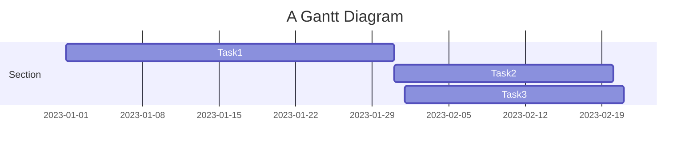
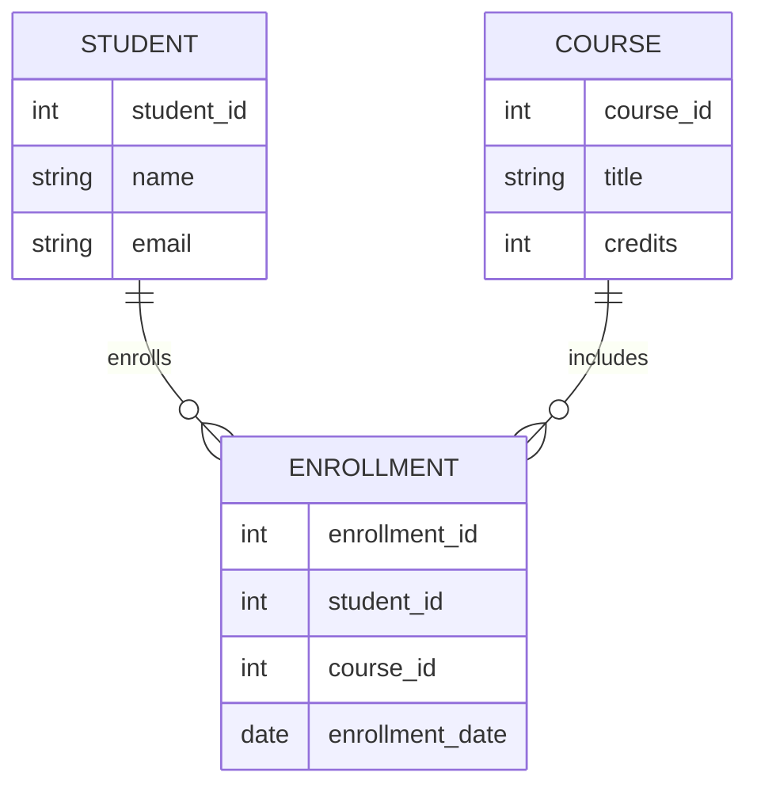

```mermaid
gantt
    dateFormat  YYYY-MM-DD
    title A Gantt Diagram
    section Section
    Task1           :a1, 2023-01-01, 30d
    Task2           :after a1  , 20d
    Task3           : 2023-02-01  , 20d

```

```mermaid
erDiagram
    STUDENT {
        int student_id
        string name
        string email
    }
    
    COURSE {
        int course_id
        string title
        int credits
    }
    
    ENROLLMENT {
        int enrollment_id
        int student_id
        int course_id
        date enrollment_date
    }
    
    STUDENT ||--o{ ENROLLMENT : enrolls
    COURSE ||--o{ ENROLLMENT : includes
```
멋있음